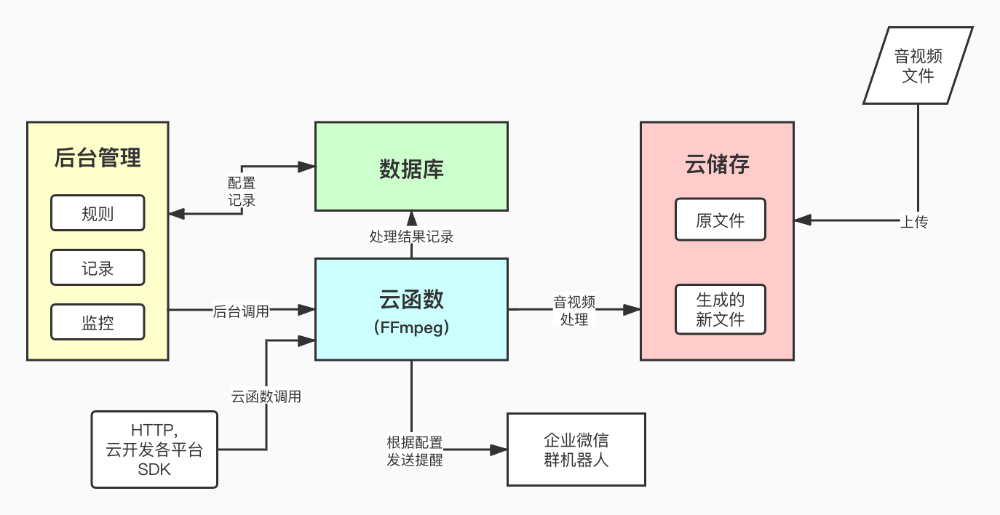
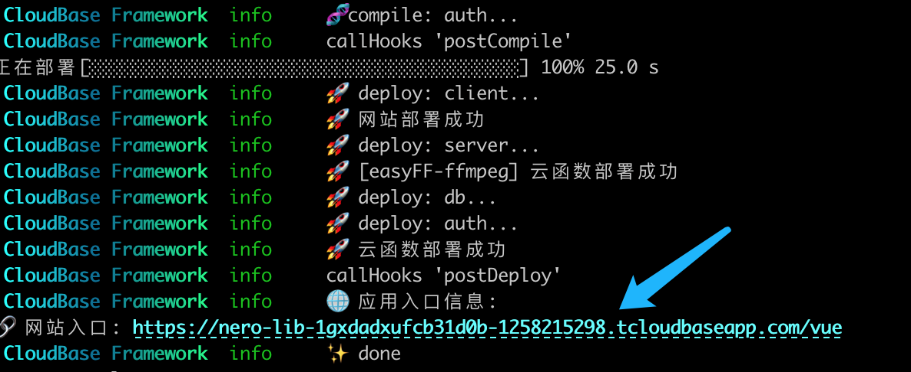
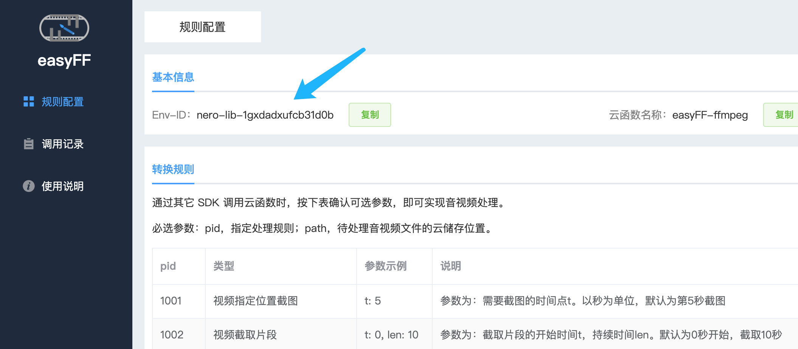
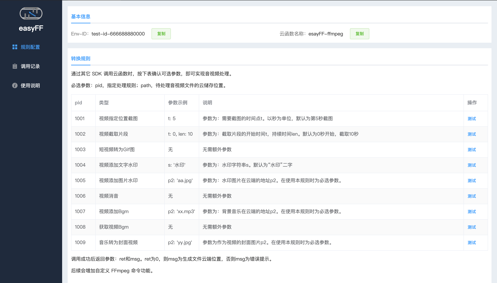
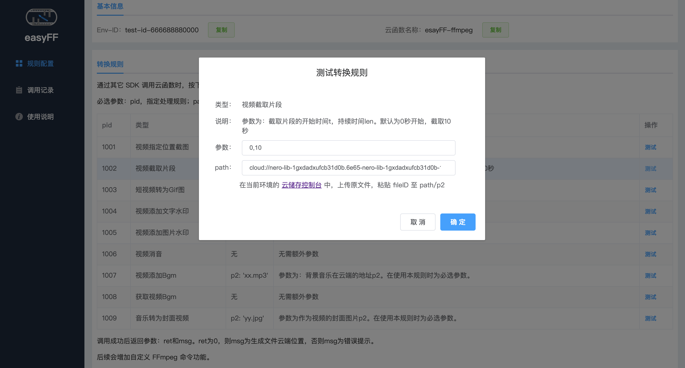
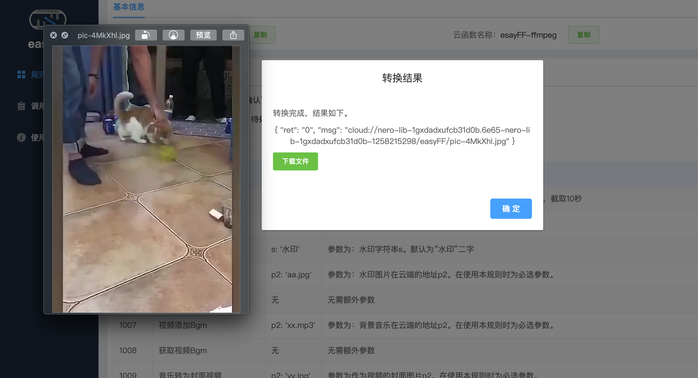

<p align="center">
  
</p>

# [easyFF](https://github.com/NeroSong/easyFF-CloudBase)

基于 FFmpeg 的简单短视频处理服务 + 后台管理 工具。

## 简介

一堆视频需要批量截取？用户上传的录像需要做些简单处理？

使用 esayFF，部署成功即可获得拥有以下能力的云函数：

- 指定位置截图 / 截取片段
- 短视频转换为 GIF 动图
- 添加水印文字 / logo 图片
- 视频消音 / 添加 bgm / 提取背景音乐
- 音乐转换为带封面视频
- …… (更多功能正在添加中，后续将支持手动指定 FFmpeg 命令！)

可直接加入现有的业务流程，也可在后台手动生成下载。

后台包含简单的数据统计，可随时查看调用情况。

## 开发者信息

本应用由 [Nero Song](https://github.com/NeroSong/) 开发提供。

## 使用

本项目包含四部分（在腾讯云云开发环境下）：



- 数据库：记录配置项和 API 调用量
- 云函数：实现具体音视频编辑，渲染和导出功能
- 云存储：用于储存原始文件和处理后生成的新文件
- _后台页面_：查看功能配置，使用情况

部署完成之后，点击访问后台页面：



如果能看到当前的环境 ID，说明部署成功：



### 重要！
======================================================

因为框架限制云函数打包不得超过15M，所以目前包含的是一个精简版 FFmpeg ，出错率很高，需要**手动替换**：

> 没有找到更好的方法，既能实现一建部署，又不能突破框架的大小限制。欢迎指点更好的解决方案，感谢！Thanks♪(･ω･)ﾉ

点击下载 [完整版FFmpeg](https://github.com/NeroSong/FFmpeg-binary-centos/raw/main/fffmpeg)（大约70M），用其替换`cloudfunctions/easyFF-ffmpeg`目录下的`ffmpeg`文件，然后更新云函数：
```bash
# 在项目根目录下
tcb fn code update easyFF-ffmpeg
```

更新完成后就可以正常使用啦！\\(^o^)/~

（如果是*一键云端部署*，同样需要通过 Cloudbase CLI 把 `easyFF-ffmpeg` 这个云函数下载之后替换更新...)

======================================================

选一个规则，点击最右端的测试:



点击打开控制台上传文件（可使用 test 目录中提供的文件），设定参数，粘贴fileID：



处理需要几秒钟，完成后可下载到本地，查看是否成功：



如果测试顺利，表中的处理规则即可在云开发各 SDK 中使用了。

例如在 Flutter 中：

```dart
// 先通过SDK上传文件，或其它方式获取文件云端地址

// 请求参数：@path，待处理文件云端地址
//         @pid， 要执行的功能ID
//         @t,    不同功能的参数
const data = {
  path: "cloud//xxx/abc.mp4",
  pid : 1001,
  t: 5
};

// 调用云函数 easyFF-ffmpeg，通过不同参数实现不同功能
CloudBaseResponse res = await cloudbase.callFunction('easyFF-ffmpeg', data);

// 返回参数：@ret，为0则说明成功，否则失败
//         @msg，成功返回处理后文件的云端地址，否则为失败提示信息
//         如 { ret: 0, msg : "cloud//easyFF//xxx.jpg" }
print(res.data)
```

## 部署

本项目基于腾讯开源项目 [CloudBase Framework](https://github.com/Tencent/cloudbase-framework) [](https://github.com/Tencent/cloudbase-framework) 开发部署，支持一键云端部署。

[](https://console.cloud.tencent.com/tcb/env/index?action=CreateAndDeployCloudBaseProject&appUrl=https%3A%2F%2Fgithub.com%2FNeroSong%2FeasyFF-CloudBase&branch=master)

## 开发

你也可以下载项目后，使用 [CloudBase CLI](https://docs.cloudbase.net/cli-v1/intro.html) 在终端中一键部署。

```
tcb framework deploy
```

easyFF 还在初始阶段，欢迎您的建议和反馈 :)

## 注意事项

0. 由于采用云端实时计算的方式实现，目前仅适用于短视频（建议为三分钟内，1080P 及以下分辨率），否则容易发生超时返回失败的情况。
1. 生成的音视频文件默认一直保存在云储存中，长期大量使用请注意清理，以免造成较高资源托管费用。

## 文档

- [云开发 Cloudbase 文档](https://docs.cloudbase.net/)
- [CloudBase Framework 文档](https://docs.cloudbase.net/framework/)
- [FFmpeg 文档](https://ffmpeg.org/ffmpeg.html)

## Licence

本项目采用 Apache-2.0 开源协议，文档请参阅 [LICENSE](./LICENSE) 。
